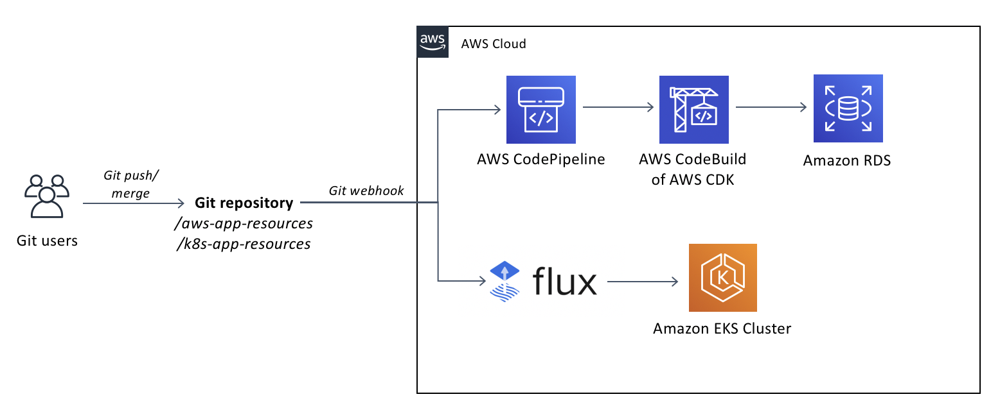
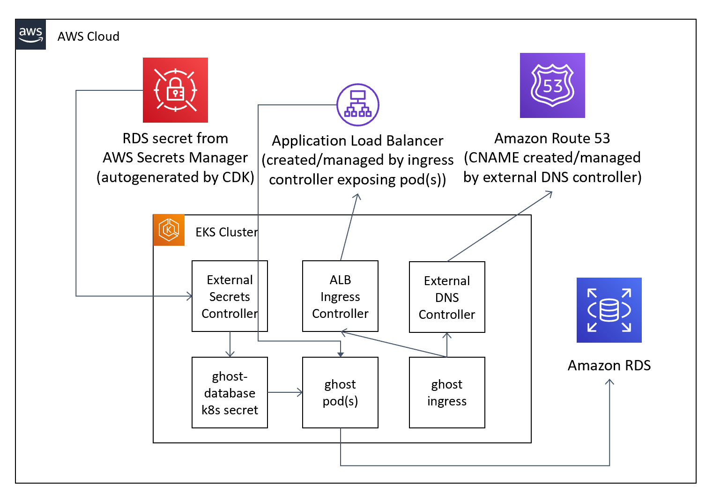

# An example approach for Kubernetes and AWS GitOps

This is a prototype for an approach for GitOps that covers both AWS Managed Services as well as Kubernetes, each with their native tooling, for a more seamless and modern experience.

It represents the AWS-specific resources (such as VPCs, EKS clusters and databases) via CDK/CloudFormation in one set of folders and another set for the Kubernetes equivalents. There are then two separate tools ([CodePipeline](https://aws.amazon.com/codepipeline/) and [Flux](https://github.com/fluxcd/flux)) that reconcile the different types of declarative Infrastructure-as-Code in this project - but all the end-user needs to know is to push/merge their changes to the Git repo.




## Gettting started
There are README.mds in each subfolder explaining how that section works and how to deploy it.

The GitOps folder structure is:

```
k8s-plus-aws-gitops/
  - aws-infrastructure/ for the AWS-specific infrastructure resources (VPC, EKS cluster, etc.)
  - aws-app-resources/ for the AWS and application-specific resources (databases, caches, queues, etc.)
  - k8s-app-resources: for the Kubernetes and application-specific resources (Deployments, Services, Ingresses, etc.)
  - dockerbuild: for the Dockerfile(s) and associated items required to build the app into a container such as the CodeBuild buildspec.yml(s)
````

Start in the aws-infrastructure folder as it deploys the AWS and EKS environments as well as deploys the pipelines for a GitOps appraoch of aws-app-resources, k8s-app-resources and dockerbuild.

## The interactions between AWS and Kubernetes (via a couple Operators/CRDs)

There are basically two main workflows that are happening between AWS and Kubernetes here:

1. Secrets upserting / syncronisation
    1. First the CDK creates a secret with the password of our RDS
    1. Then The External Secrets Controller retrieves this secret and puts it into a Kubernetes Secret our pod spec references as Environment Variables into the container(s) to connect to its database.
1. Ingress Network Routing
    1. First the ALB Ingress controller creates an ALB and exposes our service via the ALB by updating the Target Group with VPC-native Pod IPs (which is more efficient than NATing through the Hosts with a NodePort on each host)
    1. Then the External DNS Controller updates a CNAME to the ALB for the service with the 'real' name/FQDN that we want to expose it to the Internet.
